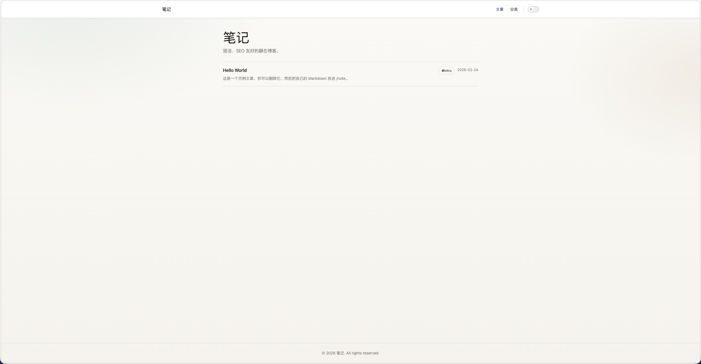
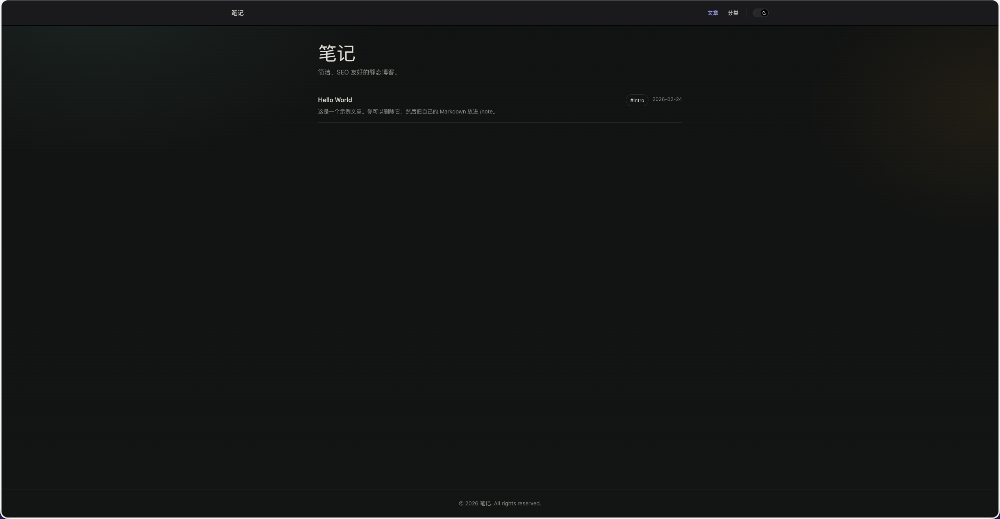

# 静态博客（VitePress）

一个基于 Vue + TypeScript 的静态博客/笔记站点。

## 核心流程

- 你只需要把 Markdown 放到 `note/`。
- push 到 GitHub 后，GitHub Actions 会自动构建并发布到 GitHub Pages（自带 CDN）。
- 构建产物输出到仓库根目录的 `dist/`。

## 展示





## 使用方法

### Fork 到私有仓库

1. Fork 本仓库到你的账号
2. 将仓库设置为 Private
3. 克隆到本地进行开发

### 定制站点信息

**修改站点标题和描述**：编辑 `.vitepress/config.ts`

```typescript
export default defineConfigWithTheme<ThemeConfig>({
  lang: 'zh-CN',
  title: '笔记',           // 修改这里
  description: '简洁、SEO 友好的静态博客。',  // 修改这里
  // ...
})
```

**修改首页标题**：编辑 `note/index.md`

```yaml
---
layout: page
title: 我的笔记  # 修改这里
---
```

### 配置黑名单

创建或编辑 `.blogignore` 文件来忽略不想上传的文件：

```
# 忽略单个文件
draft.md

# 忽略整个目录
private/

# 忽略特定模式的文件
temp-*.md

# 忽略特定路径的文件
note/work/*.md
```

### 修改 GitHub Actions 工作流

编辑 `.github/workflows/pages.yml` 来定制部署配置：

- **修改触发条件**（默认：main 分支，特定路径变化）：
  ```yaml
  on:
    push:
      branches: [main]
      paths:
        - 'note/**'
        - '.vitepress/**'
        # 添加其他需要监控的路径
  ```

- **切换到 User/Org Pages 或自定义域名**：
  ```yaml
  env:
    VITEPRESS_BASE: '/'      # 修改为 '/'（Project Pages 用 /${repo}/）
    SITE_URL: https://your-domain.com/  # 修改为你的域名
  ```

- **修改 Node 版本**：
  ```yaml
  - name: Setup Node
    uses: actions/setup-node@v4
    with:
      node-version: 20  # 修改为你需要的版本
  ```

## 写作规范

- 文章放在 `note/**.md`。
- 分类规则：默认取路径第一段目录名。
  - 例：`note/tech/a.md` -> 分类 `tech`
  - 例：`note/a.md` -> 分类 `misc`
- 标题规则：
  - 默认使用文件名（不含扩展名），例如 `hello-world.md` -> `Hello World`
  - 可用 frontmatter `title` 覆盖。
- 编辑时间：使用 Git 中该文件最后一次提交时间（CI 环境稳定可复现）。

### 可选 frontmatter

```yaml
---
title: "自定义标题（可选）"
category: "自定义分类（可选）"
summary: "列表页摘要（可选）"
description: "SEO description（可选）"
---
```

## 本地开发

```bash
npm ci
npm run dev
```

访问 `http://localhost:5173` 查看效果。

## 构建与预览

```bash
npm run build
npm run preview
```

## 部署说明（GitHub Pages）

- 工作流：`.github/workflows/pages.yml`
- 默认按照 Project Pages 生成 base：`/${repo}/`
- 如果你使用的是 User/Org Pages 或自定义域名：
  - 把工作流中的 `VITEPRESS_BASE` 改成 `/`
  - 把 `SITE_URL` 改成你的站点根（例如 `https://example.com/`）

## 切换到其他 CDN（示例思路）

- 任何支持"上传静态目录"的平台都可以：S3/OSS/COS、Cloudflare Pages、Netlify、Vercel 等。
- 做法：保留 `npm run build` 产物 `dist/`，把发布步骤替换成对应平台的 upload/deploy。
- 注意：涉及云存储通常需要密钥（Secrets），建议先确认你希望使用的平台再接入。
