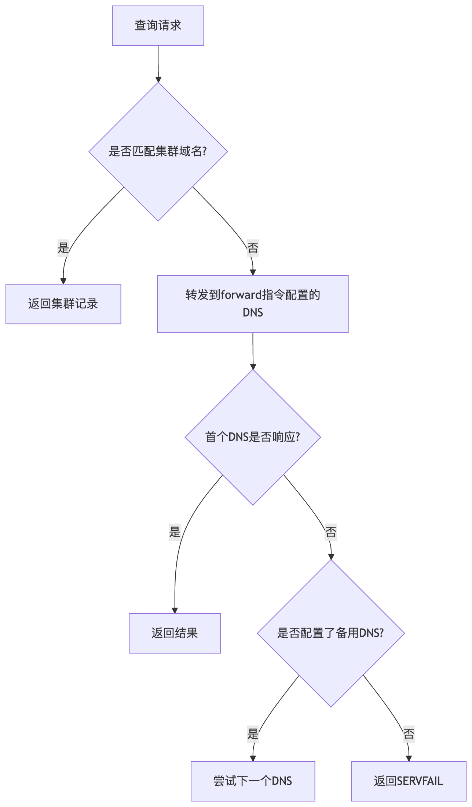
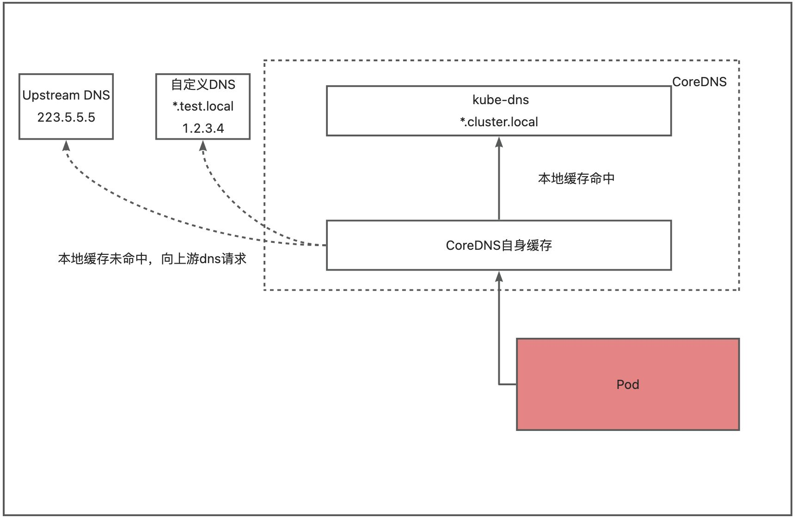

## coredns 和宿主机 dns 配置关系

### 宿主机/etc/resolv.conf 查询逻辑

- 查询顺序严格按照 nameserver 列表顺序（从上到下）查询
- 终止条件：首个返回有效响应（包括 NXDOMAIN）的服务器会被使用
- 超时处理：仅当完全无响应时才会尝试下一个 dns 服务器
- 示例配置

```
nameserver 192.168.200.10    # 内部DNS
nameserver 8.8.8.8         # Google DNS
nameserver 114.114.114.114 # 电信DNS
```

### coredns 和宿主机 dns 关系

|   |   |   |
|---|---|---|
|**场景**|**是否使用宿主机DNS**|**说明**|
|默认kubeadm安装|❌ 否|通过Corefile显式配置上游DNS|
|手动挂载宿主机resolv.conf|✅ 是|需显式配置volume挂载|
|Corefile配置`forward . /etc/resolv.conf`|⚠️ 谨慎使用|可能引发循环递归|

### coredns 上游 dns 优先级规则

- **绝对优先级**：完全由`Corefile`中的`forward`指令决定
- **常见配置方式**：

```
# 方式1：显式指定上游DNS
forward . 8.8.8.8 114.114.114.114 {
    policy sequential
    health_check 5s
}
# 应用容器本地dns
forward . /etc/resolv.conf
```

- **重要特性**：

- 不会自动混合多个配置源的DNS服务器
- 没有隐式回退机制（必须显式列出备用DNS）

### 解析失败处理流程



## CoreDNS 策略配置和域名解析配置

可以使用 dnsPolicy 字段作为集群的 pod 配置 DNS 策略，以及如何使用 HostAliases 字段在容器 pod 内部解析域名到固定地址。

### pod 内 DNS 解析请求流程

若未配置存根域，没有匹配集群域名后缀的任何请求，将转发到节点的上游域名服务器。

若已经配置存根域和上游 dns 服务器，dns 查询将基于下面的流程进行路由：

- 查询 coredns 中的 DNS 缓存层
- 在缓存层，检查请求后缀，根据下面情况转发到对应的 dns

带有集群后缀的域名，如.cluster.local，请求将被转发到 Coredns；

带有存根域后缀的域名，例如.test.local，请求将被转发到配置的自定义 DNS 解析器；

其它域名解析请求则被转发到上游 dns。如下图所示



### 使用 dnsPolicy 字段为集群的 pod 配置 dns 策略

- ClusterFirst：默认的 DNS 策略，意味着当 pod 需要进行域名解析时，首先会查询集群内部的 CoreDNS 服务。通过 CoreDNS 来做域名解析，表示 Pod 的/etc/resolv.conf 文件被自动配置指向 kube-dns 服务地址。
- None：使用该策略，Kubernetes 会忽略集群的 DNS 策略。需要你自己提供 dnsConfig 字段来指定 DNS 配置信息，否则 pod 将无法正确解析任何域名
- Default：Pod 将继承集群节点的域名解析配置。直接使用节点的/etc/resolv.conf 文件
- ClusterFirstWithHostNet：强制在 hostNetwork 网络模式下使用 ClusterFirst 策略（默认使用 default 策略）。

## 集群资源域名规则

### kube-dns 版本规则

```
<pod-IPv4-address>.<namespace>.pod.<cluster-domain>
```

示例：默认命名空间中的 Pod 的 IP 地址为 172.17.0.3， 并且集群的域名是 cluster.local。则 dns 名称为：

```
127-17-0-3.default.pod.cluster.local
```

### coredns 版本规则

```
<pod-IPv4-address>.<service-name>.<namespace>.svc.<cluster-domain>
```

示例：默认命名空间中的 Pod 的 IP 地址为 172.17.0.3， 集群的域名是 cluster.local，svc 名称为 nginx。则 dns 名称为：

```
172-17-0-3.nginx.default.svc.cluster.local
```
