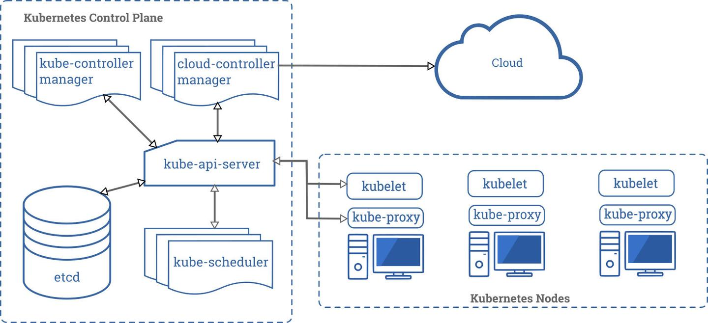
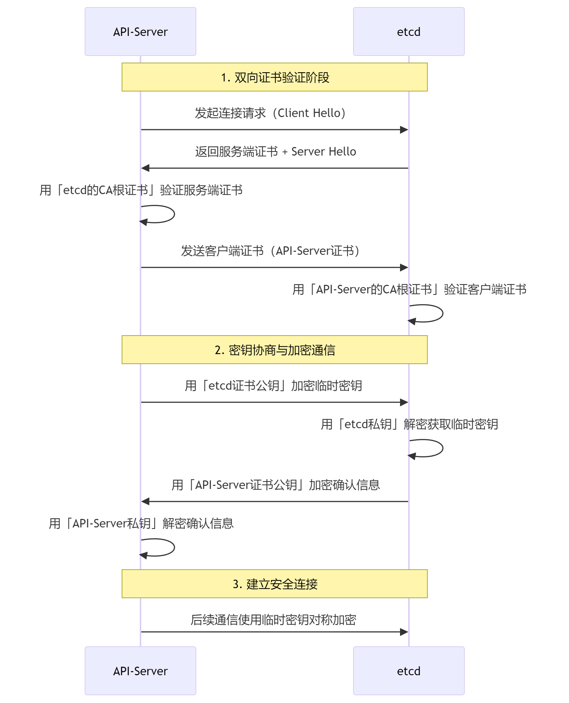
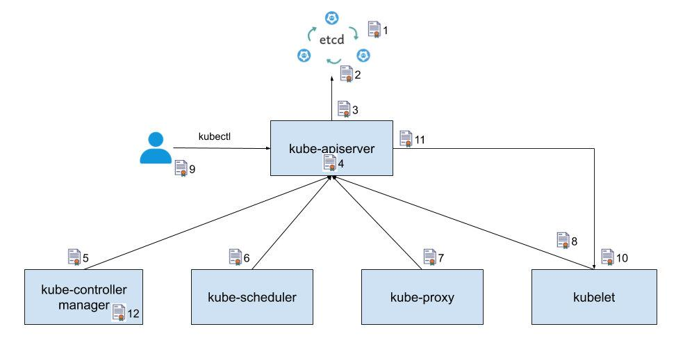
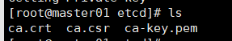
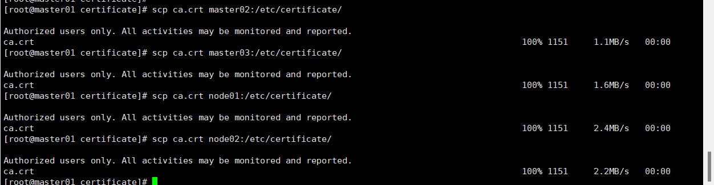
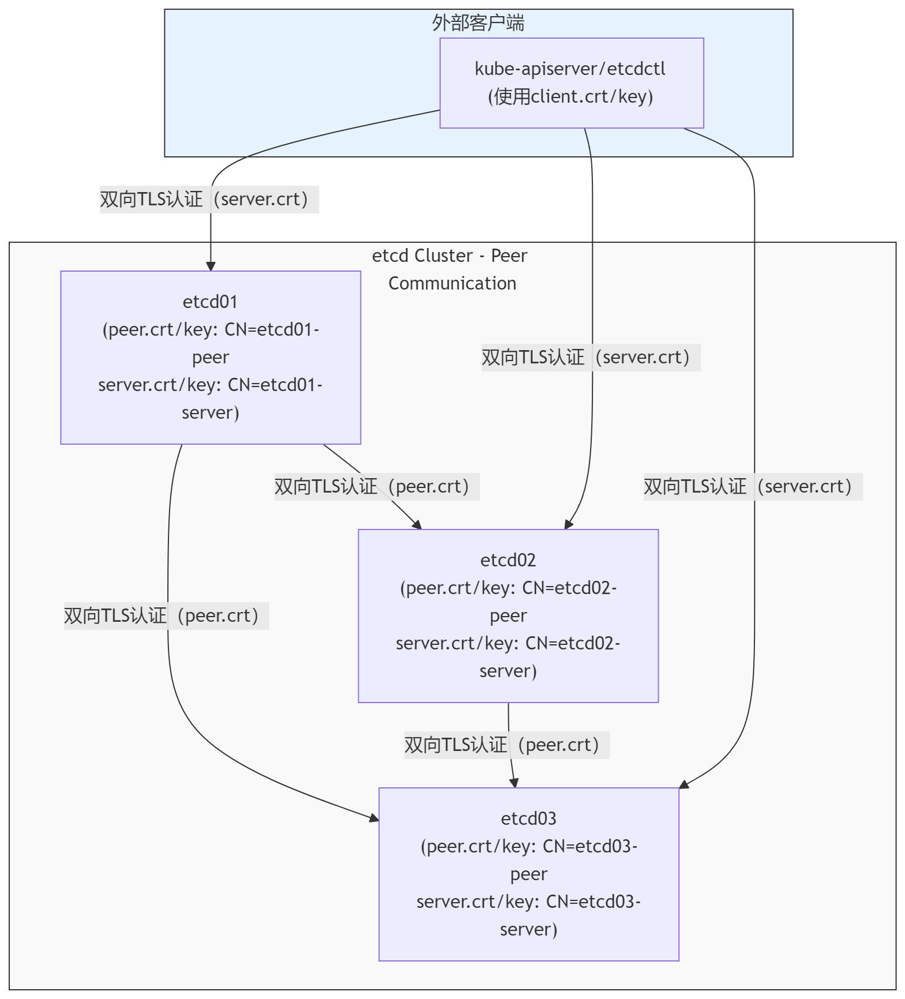

## kubernetes 证书关系



从上图可以看出 kubernetes 控制平面包含 etcd、kube-api-server、kube-scheduler、kube-controller-managger 等组件。这些组件之间会远程调用，例如 kube-api-server 会调用 etcd 接口存储数据，kube-controller-manager 会调用 kube-api-server 查询集群中的对象状态；同时 kube-api-server 也会和工作节点上面的 kubelet 和 kube-proxy 进行通信，以在工作节点上部署和管理应用。

以上这些调用都是在网络上进行，就不可避免的出现安全问题。所以这里要引入证书去加密这些组件之间的相互调用。

引入证书后每个组件要做的事情：

1. 向对方组件表明自己的身份
2. 验证对方的身份是否合法，是否伪造的？

上面的问题就是双向 TLS 认证：除了客户端需要验证服务器的证书，服务器也要通过客户端证书验证客户端的身份。这种情况下服务器提供的是敏感信息，只允许特定身份的客户端访问。

1. **服务端证书**

- 包含服务端公钥及身份信息，用于向客户端证明身份。
- 配套的**服务端私钥**用于解密客户端通过公钥加密的数据，完成身份验证。

2. **客户端证书**

- 包含客户端公钥及身份信息，用于向服务端证明身份。
- 配套的**客户端私钥**用于解密服务端通过公钥加密的数据，完成身份验证。

3. **CA 根证书**

- **服务端 CA 根证书**：客户端通过此证书验证服务端证书的合法性。
- **客户端 CA 根证书**：服务端通过此证书验证客户端证书的合法性。

下面这张图更直观一些：



### kubernetes 用到的 CA 和证书

Kubernetes 用到了大量的证书，这里仅讨论主要证书下面文件也仅仅创建主要证书。了解这些证书使用方法和原理后，也能更快理解其他证书文件。下图标识了在 Kubernetes 中主要使用到的证书和其使用位置。



1. etcd 集群内部各个节点之间互相通信使用的证书。由于一个 etcd 节点即为其他节点提供服务，又需要作为客户端访问其他节点，因此该证书可以同时作用与服务端和客户端证书。
2. etcd 集群向外提供服务使用的证书。该证书是服务器证书。
3. kube-apiserver 作为客户端访问 etcd 使用的证书。该证书是客户端证书。
4. kube-apiserver 对外提供服务使用的证书。该证书是服务器证书。
5. kube-controller-manager 作为客户端访问 kube-apiserver 使用的证书，该证书是客户端证书。
6. kube-scheduler 作为客户端访问 kube-apiserver 使用的证书，该证书是客户端证书。
7. kube-proxy 作为客户端访问 kube-apiserver 使用的证书，该证书是客户端证书。
8. kubelet 作为客户端访问 kube-apiserver 使用的证书，该证书是客户端证书。
9. 管理员用户通过 kubectl 访问 kube-apiserver 使用的证书，该证书是客户端证书。
10. kubelet 对外提供服务使用的证书。该证书是服务器证书。
11. kube-apiserver 作为客户端访问 kubelet 采用的证书。该证书是客户端证书。
12. kube-controller-manager 用于生成和验证 service-account token 的证书。该证书并不会像其他证书一样用于身份认证，而是将证书中的公钥/私钥对用于 service account token 的生成和验证。kube-controller-manager 会用该证书的私钥来生成 service account token，然后以 secret 的方式加载到 pod 中。pod 中的应用可以使用该 token 来访问 kube-apiserver， kube-apiserver 会使用该证书中的公钥来验证请求中的 token。我们将在文中稍后部分详细介绍该证书的使用方法。

通过这张图，对证书机制比较了解的读者可能已经看出，我们其实可以使用多个不同的 CA 来颁发这些证书。只要在通信的组件中正确配置用于验证对方证书的 CA 根证书，就可以使用不同的 CA 来颁发不同用途的证书。但我们一般建议采用统一的 CA 来颁发 kubernetes 集群中的所有证书，这是因为采用一个集群根 CA 的方式比采用多个 CA 的方式更容易管理，可以避免多个CA 导致的复杂的证书配置、更新等问题，减少由于证书配置错误导致的集群故障。

## 生成根证书

这个证书就是集群内的根证书，我们将用它来创建集群内其他组件所需要的证书。

### **配置私钥**

```
openssl genrsa -out ca-key.pem 2048
```

**参数介绍**

- genrsa：子命令，表示生成 RSA 私钥
- -out：指定输出私钥的文件名（ca-key.pem）
- 2048：RSA 密钥的位数（bit length），这里是 2048 位

---

### **配置自签证书的签名请求（ csr）**

```
openssl req -new -key ca-key.pem -out ca.csr -subj "/CN=Suknna Demo CA/O=Suknna"
```

**参数介绍**

- req：处理 PKCS#10 格式的证书请求（CSR），用于向 CA 申请证书。
- new：生成一个新的 CSR。如果没有 -key，会自动生成一个新私钥（需配合 -newkey 参数）。如果已存在 -key，则使用现有私钥签名 CSR。
- key：指定用于签名 CSR 的私钥文件（这里是 ca-key.pem）。
- out：指定输出的 CSR 文件名（默认 PEM 格式）。
- subj：直接设置证书主题（Subject），格式为 /字段=值。

- /C：国家。`/C=CN`
- /ST：省/州。`/ST=BeiJing`
- /L：城市。`/L=BeiJing`
- /O：组织。`/O=Suknna`
- /OU：部门。`/OU=Security`
- /CN：通用名称。`/CN=Suknna Demo CA`

---

### **配置 CA 证书**

```
openssl x509 -req -in ca.csr -signkey ca-key.pem -out ca.crt -days 36500 -extensions v3_ca -extfile <(cat << EOF
[ v3_ca ]
basicConstraints = critical,CA:TRUE
keyUsage = critical, cRLSign, keyCertSign
subjectKeyIdentifier = hash
EOF
)
```

**参数介绍**

- openssl x509: 调用 OpenSSL 工具集中的 `x509` 命令，用于处理 X.509 证书。
- -req: 指定输入文件是一个证书签名请求 (CSR)。
- -in ca.csr: 指定要使用的 CSR 文件名为 `ca.csr`。
- -signkey ca-key.pem: 指定用于签署证书的私钥文件为 `ca-key.pem`。
- -out ca.crt: 指定生成的证书文件名为 `ca.crt`。
- -days 36500: 设置证书的有效期为 36500 天 (大约 100 年)。
- -extensions v3_ca: 指定要添加到证书的扩展信息来自配置文件中的 `v3_ca` 段。
- -extfile <(cat << EOF ... EOF): 使用 Here Document 将扩展信息配置传递给 OpenSSL。

- `**basicConstraints**`

- `CA:TRUE`：声明此证书是 CA 证书，可签发其他证书。
- `critical`：表示该扩展项必须被应用端严格检查。

- `**keyUsage**`

- `keyCertSign`：允许签发证书。
- `cRLSign`：允许签发 CRL（证书吊销列表）。

- `**subjectKeyIdentifier**`

- `hash`：自动生成主题密钥标识符（用于证书链验证）

---

### **生成文件介绍**



- ca.crt：证书本体
- ca.csr：证书请求文件，并没有实际作用。仅仅是通过这个文件去创建证书，实际使用过程中不会用到
- ca-key.pem：私钥文件用于签署证书和整个书吊销列表（CRL）。私钥必须严格保密，因为它可以用来伪造证书。

---

### 将根证书拷贝到所有节点上



## 生成 ETCD 证书

证书类型介绍：

- peer 证书：专用于 etcd 节点之间相互认证（2379 端口通信）

- 必须每个节点不同（否则无法区分节点身份）
- 命令示例：`etcd --peer-cert-file=node1-peer.crt`

- server 证书：用于所有客户端验证 etcd 服务端身份

- 可以所有节点共用相同的SAN证书（包含所有节点IP/DNS）
- 也可以每个节点不同（更安全）
- 命令示例：`etcd --cert-file=node1-server.crt`

- client 证书：给 etcdctl 和 api-server 用的服务端证书

- 给etcdctl/apiserver等使用
- 每个客户端应该不同（便于审计和权限控制）
- 命令示例：`etcdctl --cert=apiserver-client.crt`

这里我使用双 TLS 认证的方式。



### 生成 server 证书

这是集群证书用于对外提供服务的证书，作为双 TLS 的服务端证书要包含所有集群内所有 ip 信息。

```
# 生成私钥
 openssl genrsa -out etcd-server-key.pem 2048
# 生成证书请求
openssl req -new -key etcd-server-key.pem -out etcd-server.csr -subj "/C=CN/ST=BeiJing/L=BeiJing/O=system:server/OU=TC/CN=server" -reqexts SAN -config <(cat << EOF
[req]
distinguished_name = req_distinguished_name
[req_distinguished_name]
[SAN]
subjectAltName=IP:192.168.200.100,IP:192.168.200.101,IP:192.168.200.102
EOF
)
#生成证书
openssl x509 -req -in etcd-server.csr -CA ../ca.crt -CAkey ../ca-key.pem -CAcreateserial -out etcd-server.crt -days 36500 -extensions v3_req -extfile <(cat << EOF

[ v3_req ]
basicConstraints = critical, CA:FALSE
keyUsage = critical, digitalSignature, keyEncipherment
extendedKeyUsage = clientAuth, serverAuth
subjectAltName = @alt_names
authorityKeyIdentifier=keyid:always

[ alt_names ]
IP.1 = 192.168.200.100
IP.2 = 192.168.200.101
IP.3 = 192.168.200.102
EOF
)
```

### 生成 peer 证书

这是 etcd 集群内部进行双 TLS 认证的证书走 2379 不对外暴露仅作为集群内部各个节点相互表明身份用的。

下面声明的地址只是让接受证书的主机确认访问地址和证书地址一致，不是别人冒充的 ip 使用这个证书进行访问。

etcd01

```
# 生成私钥
 openssl genrsa -out etcd-peer-key.pem 2048
# 生成证书请求
openssl req -new -key etcd-peer-key.pem -out etcd-peer.csr -subj "/C=CN/ST=BeiJing/L=BeiJing/O=system:server/OU=TC/CN=peer" -reqexts SAN -config <(cat << EOF
[req]
distinguished_name = req_distinguished_name
[req_distinguished_name]
[SAN]
subjectAltName=IP:192.168.200.100
EOF
)
#生成证书
openssl x509 -req -in etcd-peer.csr -CA ../ca.crt -CAkey ../ca-key.pem -CAcreateserial -out etcd-peer.crt -days 36500 -extensions v3_req -extfile <(cat << EOF

[ v3_req ]
basicConstraints = critical, CA:FALSE
keyUsage = critical, digitalSignature, keyEncipherment
extendedKeyUsage = clientAuth, serverAuth
subjectAltName = @alt_names
authorityKeyIdentifier=keyid:always

[ alt_names ]
IP.1 = 192.168.200.100
EOF
)
```

etcd02

```
# 生成私钥
 openssl genrsa -out etcd-peer-key.pem 2048
# 生成证书请求
openssl req -new -key etcd-peer-key.pem -out etcd-peer.csr -subj "/C=CN/ST=BeiJing/L=BeiJing/O=system:server/OU=TC/CN=peer" -reqexts SAN -config <(cat << EOF
[req]
distinguished_name = req_distinguished_name
[req_distinguished_name]
[SAN]
subjectAltName=IP:192.168.200.101
EOF
)
#生成证书
openssl x509 -req -in etcd-peer.csr -CA ../ca.crt -CAkey ../ca-key.pem -CAcreateserial -out etcd-peer.crt -days 36500 -extensions v3_req -extfile <(cat << EOF

[ v3_req ]
basicConstraints = critical, CA:FALSE
keyUsage = critical, digitalSignature, keyEncipherment
extendedKeyUsage = clientAuth, serverAuth
subjectAltName = @alt_names
authorityKeyIdentifier=keyid:always

[ alt_names ]
IP.1 = 192.168.200.101
EOF
)
```

etcd03

```
# 生成私钥
 openssl genrsa -out etcd-peer-key.pem 2048
# 生成证书请求
openssl req -new -key etcd-peer-key.pem -out etcd-peer.csr -subj "/C=CN/ST=BeiJing/L=BeiJing/O=system:peer/OU=TC/CN=peer" -reqexts SAN -config <(cat << EOF
[req]
distinguished_name = req_distinguished_name
[req_distinguished_name]
[SAN]
subjectAltName=IP:192.168.200.102
EOF
)
#生成证书
openssl x509 -req -in etcd-peer.csr -CA ../ca.crt -CAkey ../ca-key.pem -CAcreateserial -out etcd-peer.crt -days 36500 -extensions v3_req -extfile <(cat << EOF

[ v3_req ]
basicConstraints = critical, CA:FALSE
keyUsage = critical, digitalSignature, keyEncipherment
extendedKeyUsage = clientAuth, serverAuth
subjectAltName = @alt_names
authorityKeyIdentifier=keyid:always

[ alt_names ]
IP.1 = 192.168.200.102
EOF
)
```

### 生成 client 证书

这里的证书就可以给 etcdctl 或者 api-server 使用

```
# 生成私钥
 openssl genrsa -out etcd-client-key.pem 2048
# 生成证书请求
openssl req -new -key etcd-client-key.pem -out etcd-client.csr -subj "/C=CN/ST=BeiJing/L=BeiJing/O=system:client/OU=TC/CN=client" -reqexts SAN -config <(cat << EOF
[req]
distinguished_name = req_distinguished_name
[req_distinguished_name]
[SAN]
subjectAltName=IP:192.168.200.100,IP:192.168.200.101,IP:192.168.200.102
EOF
)
#生成证书
openssl x509 -req -in etcd-client.csr -CA ../ca.crt -CAkey ../ca-key.pem -CAcreateserial -out etcd-client.crt -days 36500 -extensions v3_req -extfile <(cat << EOF

[ v3_req ]
basicConstraints = critical, CA:FALSE
keyUsage = critical, digitalSignature, keyEncipherment
extendedKeyUsage = clientAuth, serverAuth
subjectAltName = @alt_names
authorityKeyIdentifier=keyid:always

[ alt_names ]
IP.1 = 192.168.200.100
IP.2 = 192.168.200.101
IP.3 = 192.168.200.102
EOF
)
```