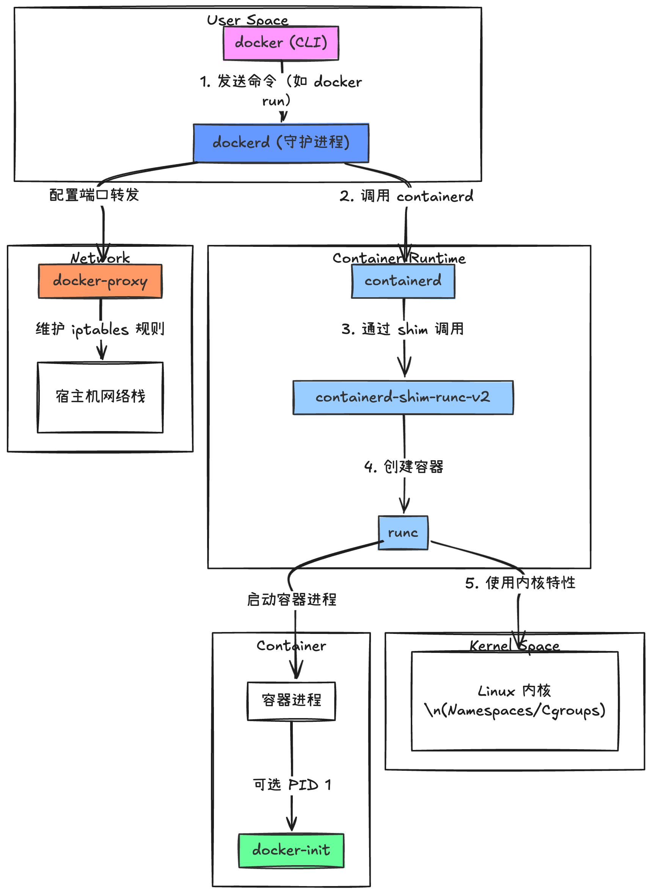

```go
containerd  
containerd-shim-runc-v2  
ctr  
docker  
dockerd  
docker-init  
docker-proxy  
runc
```

## docker
### 作用
docker客户端工具（CLI）

### 功能
用户通过docker命令（如docker run）和dockerd交互，发送指令管理容器、镜像、网络等资源。

### 层级
用户直接操作的入口，不处理实际任务，仅转发请求到dockerd中。

## dockerd
### 作用
docker守护进程（服务端）

### 功能
接受来自docker cli得请求，管理镜像、容器、网络、存储卷等。

协调底层组件如：containerd、docker-proxy完成实际操作

提供rest api供客户端调用

### 层级
核心服务端，负责整体资源调度。

## containerd
### 作用
容器运行时守护进程（独立于Docker）

### 功能
管理容器的生命周期（创建、启动、停止、删除）。

管理镜像的拉取、存储和挂载。

通过containerd-shim-runc-v2调用底层runc运行容器

### 层级
介于dockerd和runc之间，负责容器运行时得操作。

## containerd-shim-runc-v2
### 作用
容器运行时垫片（shim），用于<font style="color:rgba(0, 0, 0, 0.87);">解耦containerd和容器进程。</font>

### <font style="color:rgba(0, 0, 0, 0.87);">功能</font>
允许containerd重启或升级时不影响正在运行的容器。

收集容器的退出状态并转发给containerd

管理容器的标准输入和输出流（如日志）

### 层级
<font style="color:rgba(0, 0, 0, 0.87);">直接与内核交互，实际运行容器的工具。</font>

## <font style="color:rgba(0, 0, 0, 0.87);">ctr</font>
### 作用
containerd的命令行调试工具

### 功能
直接操作containerd的api，管理容器和镜像。

通常用于调试或高级场景（普通用户一般使用 docker cli）

## docker-proxy
### 作用
容器网络代理（基于iptabels）

### 功能
为容器端口映射（如-p 80:80）维护宿主机上的iptables规则

转发宿主机端口流量到容器内部

## docker-init
### 作用
容器内init进程（可选）。

### 功能
以PID为1运行在容器内，替代传统/sbin/init

负责回收僵尸进程、转发信号给子进程

通过--init参数启用（如docker run --init）

## 作用图
<!-- 这是一张图片，ocr 内容为：USER SPACE DOCKER (CLI) 1,发送命 (如 DOCKER RUN) V DOCKERD(守护进程) 配置端口转发 2.调用 CONTAINERD CONTAINERKUNTIME NETWORK DOCKER-OROXY CONTAINERD 维护 IPTABLES 规则 3.通过SHIM调用 宿主机网络栈 CONTAINERD-SHIM-RUNC-V2 4.创建容器 RUNC 5.使用内核特性 启动容器进程 KERNEL BPACE CONTHINER LINUX  内核 容器进程 IN(NAMESPACES/CGROUPS) 可选PID1 DOCKER-INIT -->


